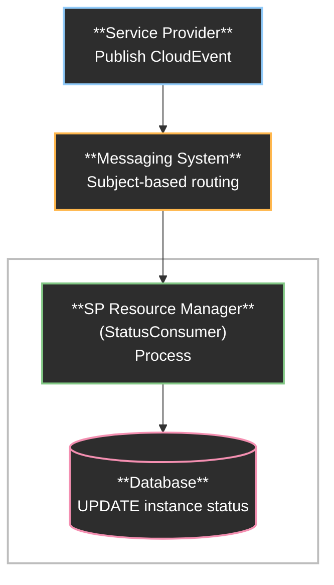
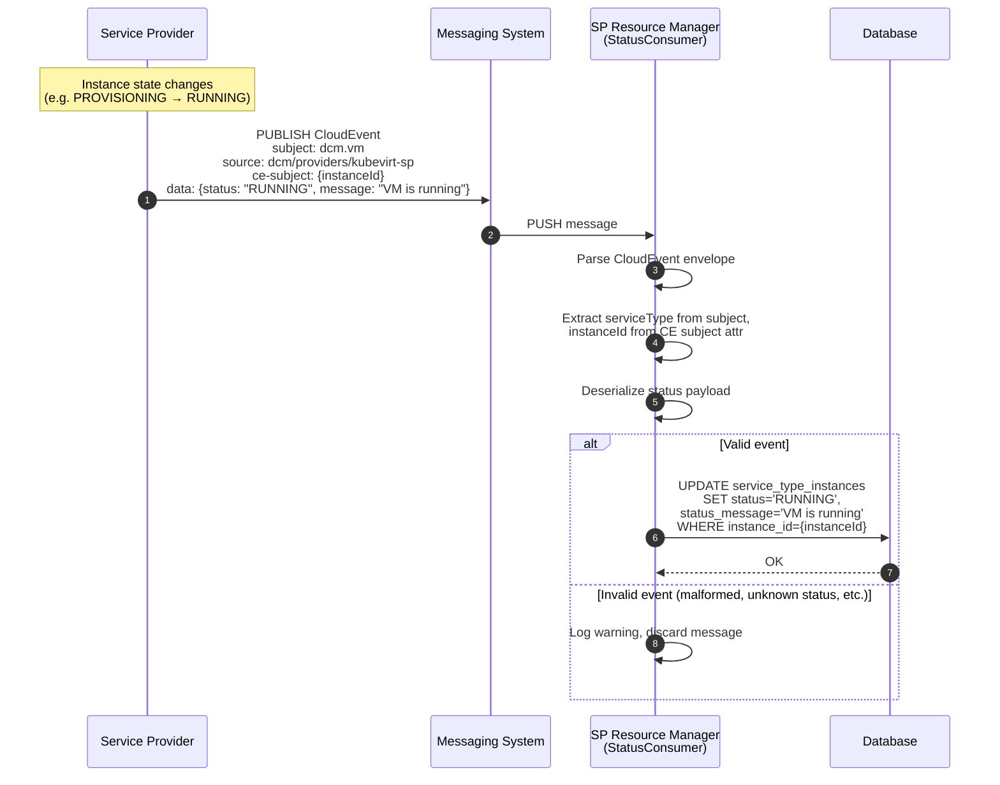

# Service Provider Resource Status Reader

## Summary

This enhancement defines how the SP Resource Manager consumes resource status
updates from the messaging system. Service Providers publish CloudEvents to a
message bus whenever an instance's state changes (e.g., `PROVISIONING` to
`RUNNING`). The SP Resource Manager subscribes to these events and updates the
corresponding instance records in the database. This closes the loop between
instance creation and ongoing lifecycle tracking within DCM core.

## Motivation

The SP Resource Manager already owns instance records created via
`POST /api/v1/service-type-instances`. However, after creation the instance
status remains `PROVISIONING` until an external signal confirms the actual state
on the underlying platform. The
[Service Provider Status Reporting](../state-management/service-provider-status-reporting.md)
enhancement defines how providers publish these signals as CloudEvents to the
messaging system. This enhancement defines the consumer side — how the SP
Resource Manager reads those messages and keeps instance status up to date.

Without this consumer, the DCM has no mechanism to reflect the real-time state
of resources, leaving users with stale status information.

### Goals

- Define how the SP Resource Manager subscribes to status events from the
  messaging system.
- Define how instance status is updated in the database.

### Non-Goals

- Defining the publishing side (covered in
  [Service Provider Status Report Implementation](../service-provider-status-report-implementation/service-provider-status-report-implementation.md)).
- Defining the CloudEvents format or status enums (covered in
  [Service Provider Status Reporting](../state-management/service-provider-status-reporting.md)).
- Defining Service Provider health checks (covered in
  [Service Provider Health Check](../service-provider-health-check/service-provider-health-check.md)).
- Defining authentication between DCM and the messaging system.
- Report drift between DCM store and service provider resource definition.

## Proposal

### Overview

The SP Resource Manager will run a background message consumer component
(**StatusConsumer**) alongside its existing HTTP server. The StatusConsumer
subscribes to a wildcard subject on the messaging system to receive all
resource status events from all providers. Upon receiving a message,
extracts the instance identifier, and updates the instance record in the 
database.

### Architecture



### Integration Points

#### Messaging System

- Subscribes to wildcard subject `dcm.*` to receive all status events.
- Uses NATS JetStream for at-least-once delivery guarantees on critical
  transitions.
- Handles automatic reconnection and re-subscription on connection loss.

#### Database

- Updates existing instance records created during
  `POST /api/v1/service-type-instances`.
- Performs idempotent UPDATE operations on instance status.

## Design Details

### Subscription Strategy

The StatusConsumer subscribes to a single wildcard subject that matches all
status events across all service types:

```
dcm.*
```

This matches the subject hierarchy defined in the
[Service Provider Status Reporting](../state-management/service-provider-status-reporting.md)
enhancement:

```
dcm.{serviceType}
```

For example: `dcm.vm`, `dcm.container`, `dcm.cluster`.

The `serviceType` token in the subject determines the message schema. All other
context — provider identity (`source`), instance identifier (`subject`), and
timestamps — is carried in the CloudEvent envelope attributes. This keeps the
subject hierarchy simple and avoids encoding routing-irrelevant metadata in the
subject.

### Message Processing Pipeline

The StatusConsumer processes each incoming message through the following steps:

1. **Parse CloudEvent Envelope** — Deserialize the message into a CloudEvent
   v1.0 structure. Discard and log if the envelope is malformed.
2. **Extract Metadata** — Extract `serviceType` from the NATS subject,
   and provider identity from the CloudEvent `source` attribute.
3. **Deserialize Payload** — Decode the CloudEvent data field into the
   appropriate struct.
4. **Update Database** — UPDATE the instance record with the new status and
   message.

### Database Update

The instance record is updated using an idempotent UPDATE operation:

```sql
UPDATE service_type_instances
SET status = $1, status_message = $2, updated_at = NOW()
WHERE instance_id = $3
```

If the `instanceId` does not match any existing record, the update is a no-op
and a warning is logged. This can occur when an instance has been deleted
before the status event was processed or when events arrive out of order.

### Status Update Flow



### Lifecycle Integration

The StatusConsumer starts and stops alongside the SP Resource Manager process:

1. **Startup** — After the HTTP server is initialized, the StatusConsumer
   establishes a connection to the messaging system and subscribes to the
   wildcard subject. It runs as a background goroutine.
2. **Shutdown** — On graceful shutdown (e.g., `SIGTERM`), the NATS subscription
   is drained to process in-flight messages before the connection is closed.
