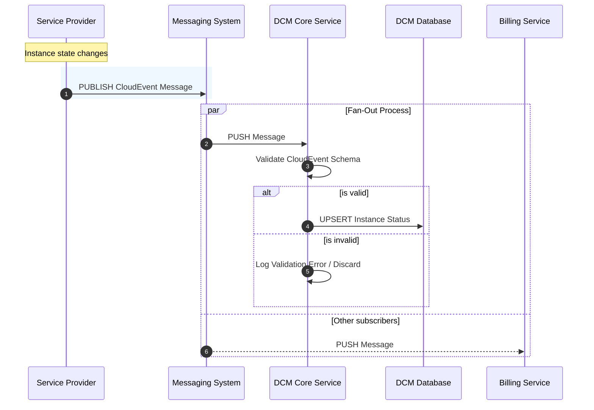

# Service Provider Status Reporting via messaging system by CloudEvents

## Summary

This proposal outlines the event-driven architecture for reporting Service
Provider resource states (e.g., VM or Container status). By leveraging the
messaging system and [CloudEvents](https://cloudevents.io/) as the standard data
format, we establish a scalable "fire-and-forget" mechanism. Service Providers
will publish status updates to a message bus, which the DCM subscribes to,
ensuring the observed state of the system is updated in near real-time without
tight coupling or API bottlenecks.

## Motivation

As the platform scales to support thousands of instances across multiple
providers, the current synchronous HTTP `PUT` model poses significant risks:

1.  **Scalability:** High-frequency status updates (e.g., during mass
    provisioning or region recovery) can flood the DCM API.
2.  **Coupling:** Providers require knowledge of specific DCM endpoints and must
    implement complex retry logic for downtime.
3.  **Extensibility:** Adding new consumers (e.g., Billing, Auditing) requires
    modifying the Provider to make additional API calls.

Moving to message system and **CloudEvents** resolves these issues by decoupling
the Producer (Provider) from the Consumer (DCM) and standardizing the event
envelope.

### Goals

- Define a standardized, event-driven contract for Service Providers to report
  the "observed state" of resources.
- Decouple the Service Provider implementation from the DCM backend logic.
- Support high-throughput status reporting without degrading DCM API
  performance.
- Standardize event metadata using the CNCF CloudEvents specification.

### Non-Goals

- Defining the internal monitoring logic of specific Service Providers.
- Defining "Provider Health" (heartbeats), which is covered in a separate
  proposal.
- Authentication between DCM and SPs.

## Proposal

We propose adopting a **Kubernetes-style Declarative Model** where Service
Providers act as **Publishers** and the DCM acts as a **Subscriber**.

Instead of calling a specific API endpoint, Providers will emit events to a
message bus subject whenever an instance's state changes. The payload will
adhere to a strict schema (VMStatus/ContainerStatus) wrapped in a CloudEvent
envelope.

### User Stories

- **As a Service Provider Developer**, I want to reliantly publish a status update message
  ("fire and forget") so that I don't have to implement complex retry logic if
  the DCM is briefly unavailable.
- **As a Platform Admin**, I want to see the status of VMs update in real-time
  on my dashboard without waiting for a polling interval.
- **As a Billing System Maintainer**, I want to listen to "Instance Stopped"
  events to calculate costs without asking the Core Team to build a new API for
  me.

### Risks and Mitigations

| Risk                  | Mitigation                                                                                                                                        |
| :-------------------- | :------------------------------------------------------------------------------------------------------------------------------------------------ |
| **Message Loss**      | For critical transitions, we can use message system persistence to ensure at-least-once delivery with persistence, also to not overload database. |
| **Flooding/Flapping** | Providers must implement "Debounce" logic to avoid sending updates for rapid status oscillation (e.g., running->error->running) within milliseconds.     |

## Design Details

### 1. Flow diagram



### 2. Message system Subject Hierarchy

Providers must publish messages to a subject based on the service type:

`dcm.{serviceType}`

- `serviceType`: The type of resource (e.g., `vm`, `container`, `cluster`).

The service type determines the message schema and is the only routing-relevant
token. All other context — provider identity, instance identifier, timestamps —
is carried in the CloudEvent envelope attributes (see section 3).

### 3. CloudEvents Format

All messages must be valid JSON CloudEvents (v1.0). We currently define only
very simple format for `VmStatus` and `ContainerStatus`.

```golang
type VmStatus struct {
  Status string `json:"status"`
  Message string `json:"message"`
}
```

```golang
type ContainerStatus struct {
  Id string  `json:"id"`
  Status string `json:"status"`
  Message string `json:"message"`
}
```

**Example golang event**

```golang
cloudevents "github.com/cloudevents/sdk-go/v2"

type VmStatus struct {
  Id string  `json:"id"`
  Status string `json:"status"`
  Message string `json:"message"`
}

event := cloudevents.NewEvent()
event.SetID("event-123-456")
event.SetSource("dcm/providers/{providerName}")
event.SetType("dcm.status.vm")
event.SetSubject("dcm.{serviceType}")
event.SetData(cloudevents.ApplicationJSON, VmStatus{Id, "123-123", Status: "Running", Message: "VM is running."})
```

### 4. Status mapping

To ensure a consistent user experience across different cloud backends (e.g.,
AWS, Azure, On-Premise), the DCM enforces a strict **Generic Status Enum**.
Service Providers are responsible for normalizing their internal raw state into
these generic states before publishing the CloudEvent.

##### VM Status

Providers must map their hypervisor-specific states to the following DCM
Lifecycle Phases: `PROVISIONING`, `RUNNING`, `STOPPED`, `ERROR`, `DELETED`,
`DELETING`, `PAUSED`, `STOPPING`.

| DCM Generic Status | AWS EC2 Equivalent                              | Azure VM Equivalent      | VMWare Equivalent       |
| :----------------- | :---------------------------------------------- | :----------------------- | :---------------------- |
| **PROVISIONING**   | `pending`                                       | `Creating`               | `PoweredOff`            |
| **RUNNING**        | `running`                                       | `running`                | `PoweredOn`             |
| **STOPPED**        | `stopped`, `stopping`                           | `stopped`, `deallocated` | `PoweredOff`            |
| **FAILED**         | `terminated`, `error`                           | `Failed`                 | `Error`                 |
| **DELETED**        | `terminated`                                    | `Deleted`                | `Ref Not Found`         |
| **DELETING**       | `shutting-down`                                 | `Deleting`               | `Destroying`            |
| **PAUSED**         | `N/A (AWS does not pause, only stop/hibernate)` | `paused`                 | `Suspended`             |
| **STOPPING**       | `stopping`                                      | `stopping`               | `GuestOS Shutting Down` |

_Note: If a provider has a state that is ambiguous, they should default to the
closest "active" state or `ERROR` if functionality is impaired._

##### Container status

For container providers, we align closely with the Kubernetes Pod Phase model
but simplified for general consumption. **Target Statuses:** `PENDING`,
`RUNNING`, `SUCCEEDED`, `FAILED`, `UNKNOWN`.

| DCM Generic Status | Kubernetes / Docker Equivalent                     |
| :----------------- | :------------------------------------------------- |
| **PENDING**        | `Pending`, `ContainerCreating`, `ImagePullBackOff` |
| **RUNNING**        | `Running`                                          |
| **SUCCEEDED**      | `Succeeded`, `Exited (0)`                          |
| **FAILED**         | `Failed`, `CrashLoopBackOff`, `Exited (non-zero)`  |
| **UNKNOWN**        | `Unknown` (Node lost)                              |

##### Cluster status

For managed clusters (e.g., K8s clusters), the status reflects the health of the
control plane and worker nodes as a single unit. **Target Statuses:**
`CREATING`, `ACTIVE`, `UPDATING`, `DEGRADED`, `DELETED`.

| DCM Generic Status | Kubernetes                                                         |
| :----------------- | :----------------------------------------------------------------- |
| **CREATING**       | Control plane is provisioning; API is not yet reachable.           |
| **ACTIVE**         | Control plane is healthy and minimum worker nodes are ready.       |
| **UPDATING**       | Rolling upgrade in progress (API remains reachable).               |
| **DEGRADED**       | Control plane is reachable, but critical components are unhealthy. |
| **DELETED**        | Cluster resources have been de-provisioned.                        |

## Message systems

We evaluated several architectural approaches for using message system.

1. Apache Kafka is a distributed event streaming platform known for its high
   durability and strict ordering, which allows for replaying historical events.
   While excellent for long-term data retention and audit trails, its heavy
   operational footprint (requiring ZooKeeper or KRaft clusters) and higher
   end-to-end latency make it less ideal for simple, real-time ephemeral state
   synchronization.

2. RabbitMQ offers robust reliability and complex routing capabilities through
   its "Exchange" architecture, ensuring messages are rarely lost via mature
   acknowledgement mechanisms. However, its "smart broker" design can become a
   throughput bottleneck during high-load bursts, and managing queues for
   thousands of dynamic provider instances adds significant configuration
   overhead.

3. REST API (Synchronous HTTP) Sticking with the status quo of synchronous PUT
   requests offers the highest simplicity and ease of debugging using standard
   HTTP tools. However, this approach enforces tight coupling between the
   Provider and DCM, where high-frequency bursts (such as a region recovery) can
   overwhelm the API server and force developers to implement complex retry
   logic.

4. gRPC Streaming provides high performance and strong typing via binary
   Protobuf serialization, ensuring low-latency communication over HTTP/2. The
   primary downside is its point-to-point nature; it lacks inherent "fan-out"
   capabilities, requiring a custom dispatcher implementation to forward status
   updates to multiple downstream consumers like Billing or Auditing.

5. NATS is a lightweight messaging system designed for high scalability,
   offering "fire-and-forget" publishing and efficient subject-based fan-out to
   multiple subscribers. While it drastically reduces operational overhead and
   latency, it defaults to "at-most-once" delivery, meaning persistence (via
   JetStream) is required if strict delivery guarantees are needed over raw
   speed.
